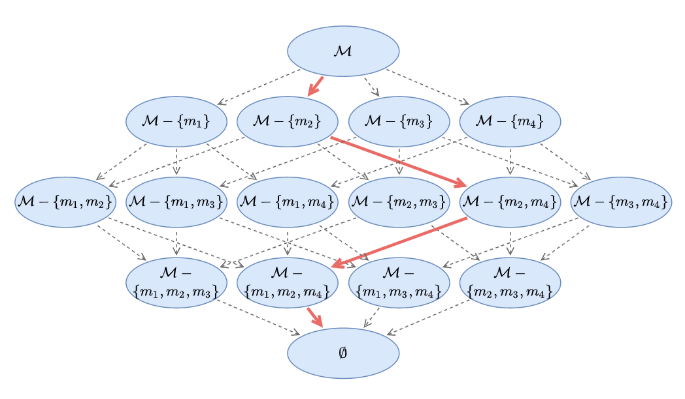

# MicroRes: Versatile Resilience Profiling in Microservices via Degradation Dissemination Indexing

This repository accompanies our ISSTA24 submission `MicroRes: Versatile Resilience Profiling in Microservices via Degradation Dissemination Indexing`.

### Architecture


### Motivating Examples
The following table shows the motivating examples of our comparison between resilient and unresilient deployments on Kubernetes.


### The Metric Lattice
The following figure shows the metric lattice constructed by the metrics. The red arrow indicates the degradation-based metric selection process.



### Steps to run
- Install the requirements.
- The `MicroRes` class provides an interface for resilience evaluation. Here's the code sample:
```python
from microres.core import MicroRes
from microres.model.distance import Euclidean, ComplexityInvariantDistance, DTW
microres = MicroRes(f_cont = ComplexityInvariantDistance.cid_distance) # select a contribution measure from microres/model/distance.py
r = microres.eval(testId, metricMetadata, normalInterval, faultyInterval, metrics) # the resilience value
```
- The dataset pkl file is organized by `(testId, metricMetadata, normalInterval, faultyInterval, metrics)`.

### Results
The output of MicroRes is a float value indicating the resilience index of the microservice system.
```python
print("Resilience Index is", r)
# Resilience Index is 0.86547
```


